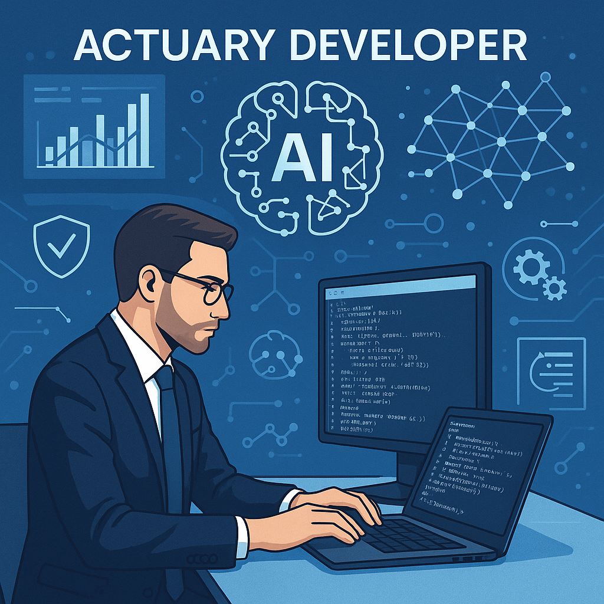

# AI as Actuarial Intelligence: Towards the Actuary of the Last Kind

## Corso di Formazione Attuariale Permanente SIA 2025

Un corso avanzato per trasformare l'attuario tradizionale in un **"Actuary Developer"**, integrando intelligenza artificiale e automazione nella pratica attuariale moderna.

---

## 📋 Panoramica

Questo repository contiene materiali e risorse per il corso di formazione attuariale che esplora l'integrazione dell'intelligenza artificiale nella professione attuariale. Il corso si concentra sullo sviluppo di competenze pratiche per l'automazione di processi, la creazione di report dinamici e l'utilizzo di dati sintetici nel ratemaking.

**Data:** Venerdì 11 luglio 2025  
**Modalità:** Diretta web (Teams)  
**Orario:** 9:30 - 17:00  
**CFP:** 5 crediti formativi professionali

## 📁 Struttura del Repository

```
├── Codice/                 # Script R e codici sorgente del corso
├── Documenti/              # Documentazione tecnica e materiali di supporto
├── Immagini/               # Risorse grafiche e copertina del corso
├── Risorse/                # Dataset, file di esempio e risorse didattiche
├── Slides/                 # Presentazioni e materiali delle lezioni
├── .gitattributes          # Configurazione Git per il repository
└── README.md               # Questo file
```

### **Descrizione delle Cartelle**

- **`Codice/`** - Contiene tutti gli script R sviluppati durante il corso, esempi pratici e template per l'implementazione delle tecniche apprese
- **`Documenti/`** - Include guide tecniche, documentazione API, riferimenti bibliografici e materiali di approfondimento
- **`Immagini/`** - Raccoglie immagini, grafici, diagrammi e la copertina del corso utilizzati nelle presentazioni
- **`Risorse/`** - Dataset di esempio, file di configurazione, template e altre risorse necessarie per gli esercizi pratici
- **`Slides/`** - Presentazioni PowerPoint e HTML dei singoli moduli formativi

## 🎯 Obiettivi

Il corso mira a fornire agli attuari competenze avanzate per:

- Creazione di report automatizzati e dashboard interattive
- Integrazione di tecniche di intelligenza artificiale nella pratica attuariale
- Automazione di processi attuariali complessi
- Generazione e utilizzo di dati sintetici
- Sviluppo di soluzioni innovative nel ratemaking attraverso coding assistito

## 👥 Docenti

- **Dott.ssa Francesca Liguori** - NL Risk Manager presso UnipolSai
- **Dott. Manuel Caccone** - Quant Actuary/NL Risk Manager presso UnipolSai

## 🔧 Prerequisiti Tecnici

- **R Programming**: Configurazione di RStudio sulla propria macchina
- Conoscenze base di programmazione statistica

## 📚 Struttura del Corso

### **Modulo 1: RMarkdown – Report Automatizzati**
*Dal codice alla presentazione professionale*

- Fondamenti di RMarkdown: YAML, chunk, integrazione output
- Output avanzati: PowerPoint, PDF LaTeX, HTML interattivi
- Automazione: report parametrici

### **Modulo 2: Dashboard Interattive**
*Dalla presentazione statica all'interattività*

- Visualizzazioni dinamiche: plotly, DT
- Dalla presentazione PowerPoint alla dashboard HTML allegabile via email

### **Modulo 3: IA e Dati Sintetici - Fondamenti**
*Boost alla modellizzazione attuariale*

- Principi dati sintetici: definizione, vantaggi, sfide GDPR/Solvency II
- Modelli generativi: reti GANs
- Implementazione: pacchetti R (synthpop, mice), portfolio sintetici

### **Modulo 4: Ratemaking con Dati Sintetici**
*Gestione cluster non densamente popolati*

- Sfide ratemaking: cluster sottopopolati, credibilità tariffaria
- Synthetic augmentation: oversampling intelligente, generazione condizionale

### **Modulo 5: Vibe Coding for Actuaries**
*Da Attuario ad Actuary Developer*

- AI assisted coding: GitHub Copilot, ChatGPT/Claude, code review automatizzato
- Il pacchetto groqR per l'integrazione di modelli IA
- Il pacchetto gander per l'automazione dell'ambiente di calcolo
- Actuary Developer mindset: code-first-approach, scalabilità, open source

## 🛠️ Metodologia

Ogni modulo combina:
- **Lezioni teoriche** - Fondamenti concettuali
- **Workshop pratici** - Applicazioni guidate
- **Sessioni di coding** - Implementazione hands-on

## 🔍 Tecnologie e Strumenti

- **R/RStudio** - Ambiente di sviluppo principale
- **RMarkdown** - Generazione report automatizzati
- **Plotly & DT** - Visualizzazioni interattive
- **GitHub Copilot** - AI-assisted coding
- **GANs** - Generazione dati sintetici
- **Pacchetti R specializzati**: synthpop, mice, groqR, gander

## 📈 Competenze Acquisite

Al termine del corso, i partecipanti saranno in grado di:

- Automatizzare completamente il processo di reporting attuariale
- Creare dashboard interattive per stakeholder non tecnici
- Implementare modelli generativi per dati sintetici
- Utilizzare l'IA per supportare il coding e la revisione del codice
- Adottare un approccio "code-first" nella pratica attuariale

## 🚀 Il Futuro dell'Attuario

Questo corso rappresenta un ponte verso il futuro della professione attuariale, dove l'integrazione tra competenze tradizionali e nuove tecnologie diventa essenziale per rimanere competitivi in un mercato in rapida evoluzione.

L'approccio "Actuary Developer" combina:
- **Competenze attuariali tradizionali** con **strumenti di sviluppo moderni**
- **Analisi del rischio** con **automazione intelligente**
- **Metodologie consolidate** con **innovazione tecnologica**

## 📝 Certificazione

Il corso è riconosciuto dal Consiglio Nazionale degli Attuari e rientra tra le attività preclassificate per la Formazione Attuariale Continua (FAC), con attribuzione di **5 CFP**.

## 🏢 Organizzatore

**Società Italiana degli Attuari (SIA)**
- Viale delle Milizie, 1 - 00192 Roma
- Email: info@sia-attuari.it
- Certificata ISO 9001:2015

---

## 🤝 Contributi

Questo repository è parte di un'iniziativa educativa della SIA. Per domande o contributi, contattare la segreteria operativa.

## 📄 Licenza

Materiali didattici forniti dalla Società Italiana degli Attuari (SIA).

---

*"Towards the Actuary of the Last Kind" - Un corso per preparare gli attuari del futuro*